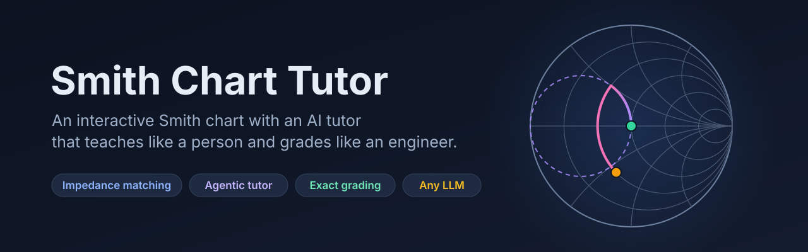
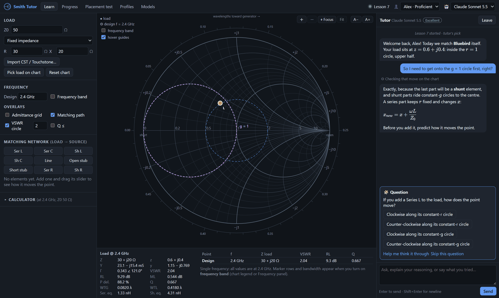
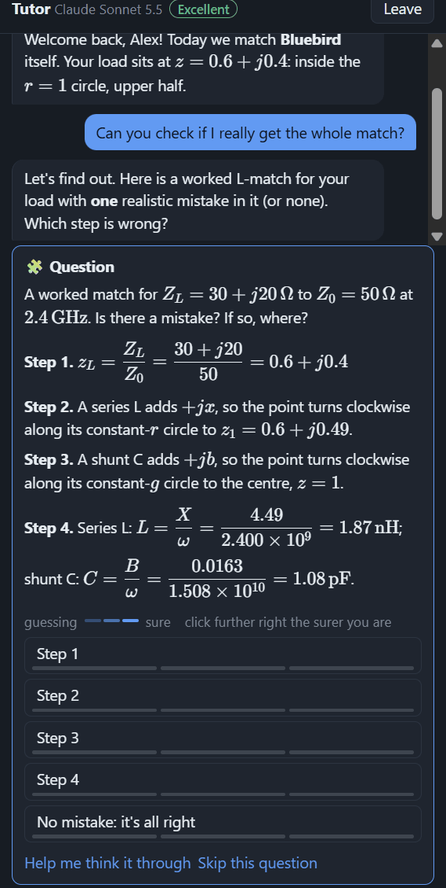
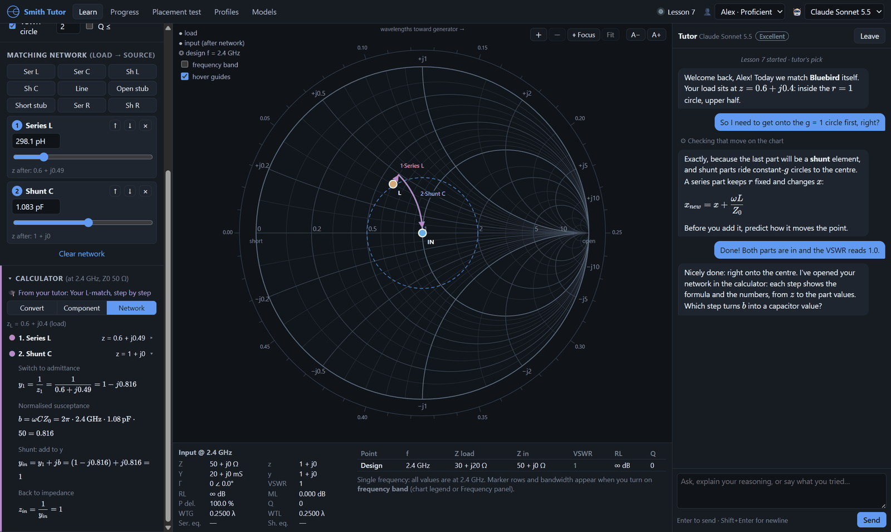
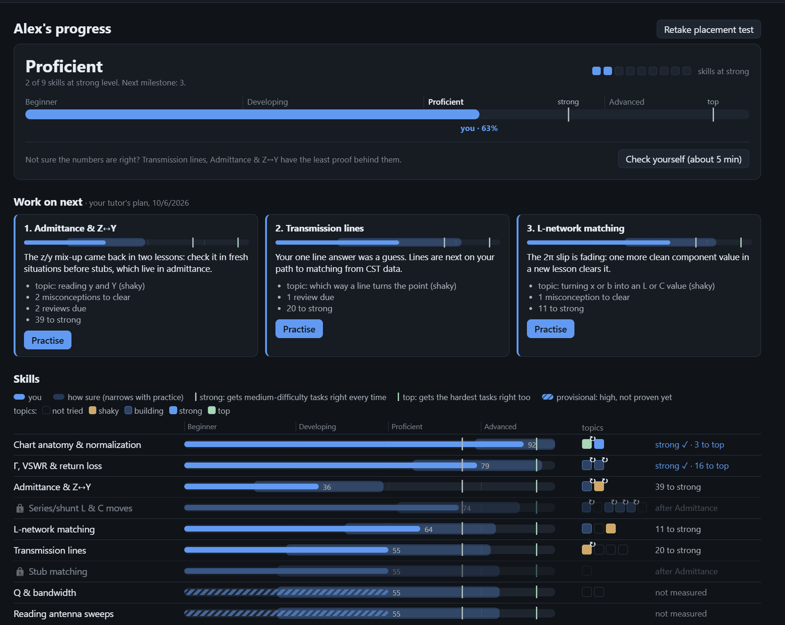
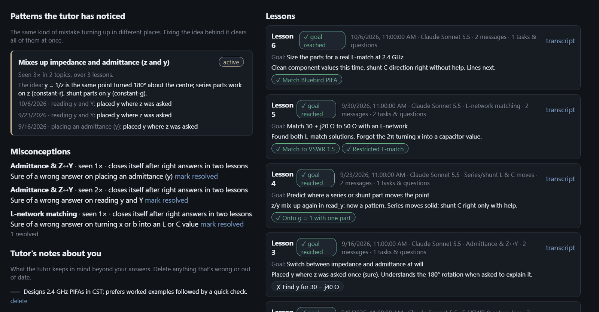
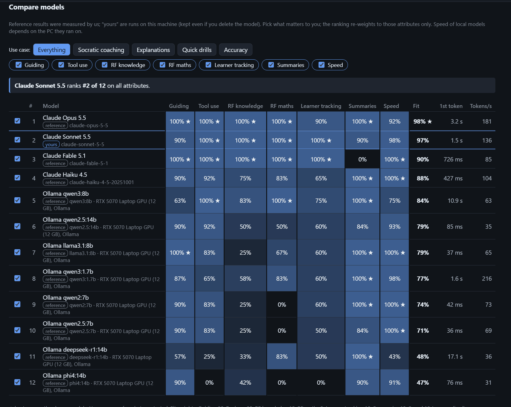
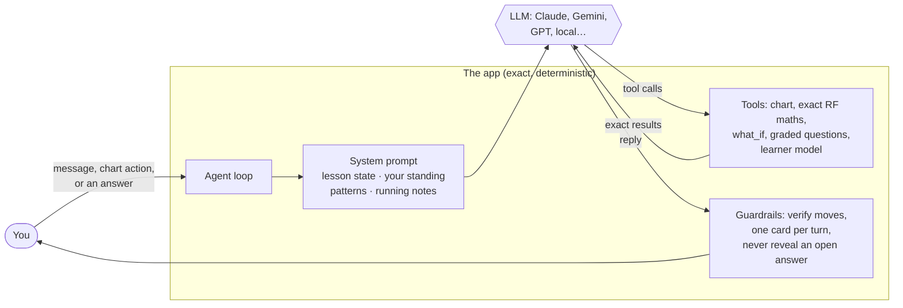
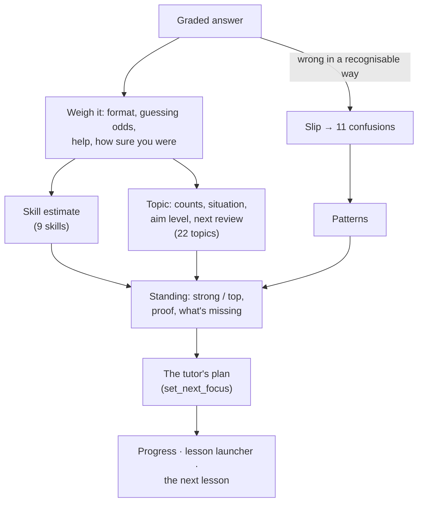

<p align="center">
  
</p>

<p align="center">
  
  
  
  
  
</p>

<p align="center">
  <b>Learn the Smith chart the way you'd learn it from a good mentor:</b><br>
  predict, try it on the chart, explain why, and get questions that find exactly where your understanding stops.
</p>

---

<p align="center">
  
</p>

## Why

Most Smith chart tools are calculators: they give you the answer. Most AI tutors are chatbots: they explain fluently but can't tell whether *you* understood, and they get the RF maths wrong now and then.

Smith Chart Tutor combines the two.

- **A real, interactive Smith chart.** Every metric is live: Z, z, Y, y, Γ, VSWR, return loss, mismatch loss, Q, WTG/WTL. You can import CST and Touchstone data.
- **An agentic AI tutor** that sees your chart, sets you tasks, and remembers you across lessons. It works with Claude, Gemini, OpenAI, OpenRouter, or a local model through Ollama or LM Studio.
- **Exact grading.** The LLM never grades and never does arithmetic in its head. The app computes every right answer, verifies every move before the tutor explains it, and records what each answer actually proves.

## Features

### 🧭 Lessons with a goal, not a chat log
Each lesson has one goal and a short checklist of steps. The tutor follows **predict → act → verify**: before you add an element, it asks what will happen. Then you try it on the chart and talk about the gap. It escalates help step by step, from a guiding question to a pointer on the chart to a hint to a worked step, and doesn't hand out answers.

### 🛠️ A Design tab for real work
When you just need a load matched, the **Design** tab has an assistant that does it with you, on its own chart. Import your measured data and say what you need. It works out the L-network and single-stub matches, checks each across your band, and shows the best 2–3 as cards with exact numbers and a recommendation. You apply one with a click, and Undo puts things back. Nothing there is graded. **Teach me why** opens a tutor lesson on that design.

### ✅ Questions that are graded exactly, and hard to bluff
The tutor designs its own questions, and the app works out the right answer for each:

| Question | What you do |
|---|---|
| **Move** | Which way, and along which circle, one element moves the point, *and why*. A right direction for the wrong reason counts as partly right. |
| **Locate** | Click a spot on the chart, or type it. |
| **Value** | Read or work out one number: VSWR, return loss, \|Γ\|, the angle of Γ, z, y, Q or WTG. |
| **Component** | Type the part that adds a given x or b, such as `1.1 pF`. The unit says which part you chose. |
| **Spot the mistake** | A worked L-match with one realistic planted mistake, or none. Find the step. |
| **Tasks** | Match to a VSWR target, or get onto a circle using limited elements. Your network is checked exactly. |

<table>
<tr>
<td width="38%" valign="top">

</td>
<td valign="top">

**How sure are you? One click says it.** Where you click an answer records your confidence: the left third is a guess, the middle is not sure, the right third is sure. There is no extra tap.

- **Right but unsure** counts less and comes back for review soon.
- **Wrong but sure** is a real misconception. It goes to the top of the tutor's list.
- **A wrong guess** is a gap, not a misconception.

Progress shows how well you judge yourself, so you can tell whether you're under- or overconfident.

**Answers count for what they prove.**

- A right pick from 4 choices is discounted by the 1-in-4 chance of guessing it.
- Help from the tutor makes an answer only partly yours.
- A skill only becomes **strong** with proof: right answers on your own, in two lessons, at medium difficulty or harder, in two different situations. Until then it shows as *provisional*.

</td>
</tr>
</table>

### 🧮 A calculator for the arithmetic after the chart
Reading the chart is the skill, and the arithmetic that follows can go to the calculator. It converts a point into every form, finds the L or C for a given reactance or move, and walks through your whole network **step by step, with typeset formulas**. The tutor can open it filled in to show you a calculation, and it sees what you calculated.

<p align="center">
  
</p>

### 📈 Know where you stand, and what to work on next
The Progress page compares you with two targets. **Strong** means right every time at medium difficulty; **top** means right at the hardest level too. Each skill has a bar with a "how sure" range that narrows as evidence builds up. Each topic gets a square: not tried, shaky, building, strong or top.

**The tutor decides what's next**, with a reason for each pick, and every screen shows that one plan.

<p align="center">
  
</p>

### 🔁 It notices patterns, like a human tutor would
The app knows every right answer exactly, so it can tell *how* an answer is wrong. Some examples:

- a click mirrored through the centre is the admittance point
- a value off by 2π means ω was forgotten
- |Γ| given where VSWR was asked

Each of these maps to one of 11 underlying confusions. When the same confusion turns up **in two topics or two lessons**, it becomes a *pattern*. The tutor names it with the evidence and teaches the root idea.

When is a mistake really fixed? The app judges it the way a good tutor would, not with one rule for everyone. Right answers in **later** lessons count (never the lesson the mistake appeared in), more when you were sure, gave the right reason, or did it in a new situation. The bar comes from your own record: lower if your fixes usually stick, higher for a mistake that keeps coming back. With little history, everyone starts at the same standard bar. A cleared mistake is re-checked once later before it counts as confirmed.

<p align="center">
  
</p>

### 🤖 Bring any model, and compare them honestly
**Free local tutor in one click:**

1. The app reads your GPU and memory.
2. It recommends the best local model your machine can run, judged by the benchmark below.
3. It installs Ollama for you, with no admin rights, and downloads the model.
4. It measures the real speed on your computer, for example "Answers start after about 6 s and come at about 39 words a second (fully on your GPU)", before you rely on it.

Or add a connection (Anthropic, Google Gemini, OpenAI, OpenRouter, Ollama, LM Studio, or any OpenAI-compatible endpoint), then pick from its models. Keys are encrypted with your OS keychain, stay in the main process, and only go to that provider.

The built-in benchmark runs **18 checks, all graded by code**, one group for each job the model does in the app: guiding, tool use, RF knowledge, RF maths, learner tracking, summaries and speed. Reference results ship with the app, so you can compare cloud and local models before you choose.

<p align="center">
  
</p>

## How the tutor works

The tutor is an **agent**: it decides which tools to use, and nothing is scripted. Around it, the app keeps it honest.



Some of the guardrails that make any model a safer tutor:

- **Every move is verified before it's explained.** If the tutor describes a direction, chart half or arc without having checked it this turn, the reply is withdrawn and rewritten from exact move facts.
- **Coordinates are never assumed.** Every lesson step records whether it reads the chart as impedance or admittance.
- **Open questions stay open.** While a card is waiting for you, the tutor is told not to give its answer away.
- **The lesson survives a model switch.** The goal, steps, coordinates and running notes carry over.
- **Long lessons stay coherent.** As older messages fall out of the model's context, they're folded into running notes. The start of a three-hour lesson is still remembered.

### What the app remembers about you



The memory lives in the app, not the model, so it's the same whichever model teaches. Its size is bounded however long you use the app.

## Getting started

**No admin rights needed.** This works on locked-down work and university laptops.

### Download the app (recommended)

Go to the **[latest release](https://github.com/sampreethsharma7/smith-chart-tutor/releases/latest)** and download the file for your computer:

| Your computer | Download | Then |
|---|---|---|
| **Windows 10 / 11** | `…-Windows-Setup.exe` | Double-click it. It installs for your account only, then opens the app and adds it to the Start menu and the desktop. |
| | `…-Windows-Portable.exe` | Nothing to install: double-click it whenever you want to use the app, for example from a USB stick. |
| **Mac with Apple Silicon** (M1 or newer) | `…-Mac-arm64.dmg` | Open it and drag **Smith Chart Tutor** into **Applications**. |
| **Mac with Intel** | `…-Mac-x64.dmg` | The same. (Apple menu → **About This Mac** shows which chip you have.) |
| **Linux** | `…-linux-x86_64.AppImage` | Make it executable (right-click → **Properties** → **Allow executing**), then double-click it. On Ubuntu and Debian, the `.deb` installs it into your apps menu instead. |

<details>
<summary><b>The first time: "Windows protected your PC" or "Apple could not verify…"</b></summary>

The app isn't code-signed yet, because a signing certificate costs money every year. So your computer asks once before the first start:

- **Windows, "Windows protected your PC":** click **More info** → **Run anyway**.
- **Windows, "Smart App Control blocked…":** right-click the downloaded file → **Properties** → tick **Unblock** → **OK**, then double-click it again. Unblock needs no admin rights; turning Smart App Control off does, and isn't needed.
- **macOS, "Apple could not verify…":** click **Done**, open **System Settings → Privacy & Security**, scroll down to the message about Smith Chart Tutor and click **Open Anyway**. You only do this once.

</details>

Then pick a tutor model in the **Models** tab. You have two options:

- **A free local tutor, in one click.** The app checks your computer (its GPU and memory) and recommends the local model that scored best on its tutor benchmark and fits your machine. It then sets up [Ollama](https://ollama.com) without admin rights, downloads the model, and measures how fast it really runs on your computer before you rely on it. No key, no cost, and it works offline.
- **A cloud model,** such as Claude, Gemini or GPT. Paste an API key, and the app links to where to get one. These are faster and stronger, and paid.

**Updating:** download the new version and install or open it the same way: the installer replaces the old version. Your profiles, progress and keys are kept separately in your user data folder, so they carry over.

**Uninstalling:**

1. Remove the app:
   - **Windows:** **Settings → Apps → Installed apps → Smith Chart Tutor → Uninstall**. For the portable version, just delete the file.
   - **macOS:** drag **Smith Chart Tutor** from **Applications** to the Trash.
   - **Linux:** delete the AppImage, or `sudo apt remove smith-tutor` for the `.deb`.
2. If you used the free local tutor, also delete:
   - the app's Ollama copy (Windows `%LOCALAPPDATA%\SmithChartTutor`; macOS `~/Library/Application Support/SmithChartTutor`; Linux `~/.local/share/SmithChartTutor`)
   - the models, in `.ollama` in your home folder. Keep this one if you use Ollama for other things.
3. To remove your profiles and keys too, use **Profiles → Open data folder** before step 1, and delete that folder.

### Or run it from the source ZIP

If a download is blocked where you are, or you want the very latest changes, the source ZIP runs with a double-click too. It builds the app on your computer the first time.

1. **Download** the ZIP (green **Code** button → **Download ZIP**). On Windows, first right-click the ZIP → **Properties** → tick **Unblock** → **OK**. Then **extract** it somewhere in your user folder, for example `Documents\SmithChartTutor`.
2. **Double-click the start file for your system:**

   | Windows 10 / 11 | macOS | Linux |
   |---|---|---|
   | `Start-Windows.cmd` | `Start-Mac.command` | `Start-Linux.sh` |

The first run takes a few minutes. It downloads a private copy of Node.js (checked against its official checksum), installs the app's components and builds the app, all **inside that folder**. After that, a double-click starts the app in seconds. Both ways of running the app share the same profiles and progress.

<details>
<summary><b>Start file warnings, company networks and proxies</b></summary>

- **macOS:** if it says the file can't be opened, **right-click** `Start-Mac.command` → **Open** → **Open**. If it says you don't have permission, open Terminal and run `bash ` followed by a space, then drag the file into the Terminal window and press Enter.
- **Windows:** "Windows protected your PC" → **More info** → **Run anyway**. "Smart App Control blocked…" → delete the extracted folder, **Unblock** the ZIP as in step 1, and extract it again.
- The first run downloads from `nodejs.org`, `registry.npmjs.org` and `github.com`, about 150 MB, and uses about 600 MB of disk.
- Your company's HTTPS certificates are trusted automatically, the same way your browser trusts them.
- **Behind a proxy:** set `HTTPS_PROXY` (for example `http://proxy.company.com:8080`) before starting, or ask IT to allow those three sites.
- **Something stopped halfway:** just double-click the start file again. It carries on where it stopped. If that doesn't help, delete the hidden `.runtime` folder and try again.
- **Avoid synced folders:** the app works best outside OneDrive or Dropbox folders, which slow down installs with many small files.
- **Updating:** download the new ZIP and extract it (into a new folder, or over the old one). **Uninstalling:** delete the folder, then follow steps 2 and 3 above.

</details>

**In the app:**

1. **Profiles:** set your name, experience, goals and tutor style.
2. **Placement test** (optional): 21 exactly graded questions that set your starting level for each skill.
3. **Models:** add a connection, paste its key, tick the models you want, and run the benchmark if you like.
4. **Learn → ▶ Start lesson:** take the tutor's pick, choose a skill, bring your own question, or **Check yourself**.

### For developers

With [Node.js](https://nodejs.org) 20 or newer installed:

```bash
git clone https://github.com/sampreethsharma7/smith-chart-tutor.git
cd smith-chart-tutor
npm install
npm run dev
```

> **Running from a VS Code terminal?** VS Code sets `ELECTRON_RUN_AS_NODE=1`, which makes Electron start as plain Node. Unset it first: `unset ELECTRON_RUN_AS_NODE` in bash, or `$env:ELECTRON_RUN_AS_NODE=$null` in PowerShell.

Commands:

```bash
npm run dev         # development, with hot reload
npm run build       # production build into out/
npm start           # run the production build
npm test            # 304 tests: RF engine, importers, grading, learner model, the agent loop end to end
npm run typecheck
```

### Measured antenna data

Export S-parameters from CST as Touchstone (`.s1p` / `.s2p`) or ASCII (Real/Imag or Mag/Phase), then use **Load → Import CST / Touchstone…**. The [guide](docs/GUIDE.md#cst--measured-data) has the details.

## Project layout

```
src/
├─ shared/            pure TypeScript, no UI: fully unit-tested
│  ├─ rf/             complex maths, metrics, networks & loads, solvers, question builders, importers
│  ├─ memory.ts       topics, graded evidence, reviews
│  ├─ standing.ts     targets, proof, what to work on (one source of truth)
│  ├─ patterns.ts     slips → confusions → patterns
│  └─ benchmark.ts    the 18 model checks
├─ main/              Electron main: window, storage, encrypted keys, LLM adapters (Anthropic / OpenAI-compatible / Gemini)
├─ preload/           a narrow, safe IPC bridge
└─ renderer/src/
   ├─ chart/          the Smith chart (SVG)
   ├─ agent/          the agent loop, system prompt, guardrails, and tools/ (auto-loaded)
   ├─ views/ panels/  React UI
   └─ state/          zustand stores
```

Around it: `Start-*` and [`scripts/`](scripts/) are the one-click start from source; [`electron-builder.yml`](electron-builder.yml), [`build/`](build/) (the app icon) and [`.github/workflows/release.yml`](.github/workflows/release.yml) make the downloads on the Releases page.

**Adding a tool** means dropping a file into [`src/renderer/src/agent/tools/`](src/renderer/src/agent/tools/). It's picked up automatically, and the tutor decides when to use it. The [guide](docs/GUIDE.md#the-tutor-is-agentic-adding-tools) shows the shape of one.

## Learn more

📖 **[The full guide](docs/GUIDE.md)** covers every feature and how the app decides:

- reading the chart
- the benchmark
- the calculator
- how answers are weighed
- standing and proof
- patterns
- the tutor's memory
- what is saved, and when

## Privacy

- Everything stays on your machine, as plain JSON in your user-data folder.
- API keys are encrypted with the OS keychain and never shown to the page.
- Profile exports never include keys.
- The only network traffic goes to the model provider you choose. If you ask for the free local tutor, the app also downloads Ollama from GitHub and the model from Ollama's library; after that, the tutor runs entirely on your computer.

## License

[MIT](LICENSE) © 2026 Sai Sampreeth Indharapu
